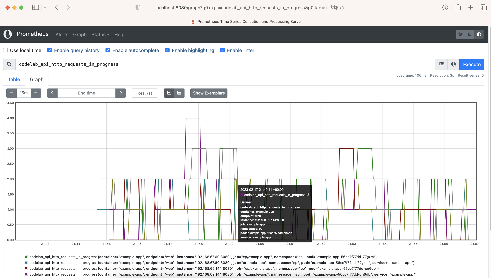
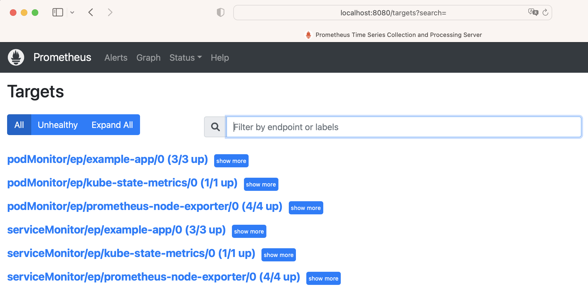

# k8s-prometheus-operator
Repo to install prometheus-operator, prometheus, kube-state-metrics and node-exporter on Kubernetes for monitoring and observability in cloud

### Prometheus

`install.sh` installs (open source) prometheus on k8s cluster with the following versions same as the versions installed in master branch:
- prometheus-operator `v0.60.1` (prometheus `v2.39.1`, prometheus-config-reloader `v0.60.1`)
- prometheus-node-exporter `v1.2.2`
- kube-state-metrics `v2.6.0`

`install.sh` will also deploy a sample app (`example-app`), `ServiceMonitor`, and `PodMonitor` custom resources for prometheus to monitor the sample app, prometheus-node-exporter and kube-state-metrics.

`delete.sh` deletes everything installed by `install.sh`.

Versions installed:
```
$ kubectl describe pods -n ns-name | grep Image: | grep 'prom\|metrics' | awk '{print $2}' | sort | uniq
k8s.gcr.io/kube-state-metrics/kube-state-metrics:v2.6.0
prom/prometheus:v2.39.1
quay.io/prometheus-operator/prometheus-config-reloader:v0.60.1
quay.io/prometheus-operator/prometheus-operator:v0.60.1
quay.io/prometheus/node-exporter:v1.2.2
```

See `example-app`'s metrics exposed at `/metrics` scraped by prometheus:

```
$ kubectl get pod,svc -n ep | grep example-app
pod/example-app-56cc7f77dd-5glg4                      1/1     Running   0          23h
pod/example-app-56cc7f77dd-8h8bc                      1/1     Running   0          23h
pod/example-app-56cc7f77dd-r8rmf                      1/1     Running   0          23h
service/example-app                                 ClusterIP   10.100.116.188   <none>        8080/TCP         23h

# forward port 8080 of example-app service to port 8083 on local host

$ kubectl port-forward example-app-56cc7f77dd-5glg4 -n ep 8083:8080
Forwarding from 127.0.0.1:8083 -> 8080
Forwarding from [::1]:8083 -> 8080

# in a different terminal on local host, see example-app's metrics scraped by prometheus

$ curl http://127.0.0.1:8083/metrics
# HELP codelab_api_http_requests_in_progress The current number of API HTTP requests in progress.
# TYPE codelab_api_http_requests_in_progress gauge
codelab_api_http_requests_in_progress 1
# HELP codelab_api_request_duration_seconds A histogram of the API HTTP request durations in seconds.
# TYPE codelab_api_request_duration_seconds histogram
codelab_api_request_duration_seconds_bucket{method="GET",path="/api/bar",status="200",le="0.0001"} 0
codelab_api_request_duration_seconds_bucket{method="GET",path="/api/bar",status="200",le="0.00015000000000000001"} 0
codelab_api_request_duration_seconds_bucket{method="GET",path="/api/bar",status="200",le="0.00022500000000000002"} 0
codelab_api_request_duration_seconds_bucket{method="GET",path="/api/bar",status="200",le="0.0003375"} 0

# 400 metrics exposed by example-app service scraped by prometheus

$ curl -s http://127.0.0.1:8083/metrics | wc -l
400
```

See node-exporter's metrics scraped by prometheus:

node-exporter's metrics will be prefixed with `node_`.

```
$ kubectl get pod,svc -n ep | grep node-exporter 
pod/ep-node-exporter-prometheus-node-exporter-7kt6x   1/1     Running   0          23h
pod/ep-node-exporter-prometheus-node-exporter-brt92   1/1     Running   0          23h
pod/ep-node-exporter-prometheus-node-exporter-ddcg2   1/1     Running   0          23h
pod/ep-node-exporter-prometheus-node-exporter-k97cm   1/1     Running   0          23h
service/ep-node-exporter-prometheus-node-exporter   ClusterIP   10.100.82.62     <none>        9100/TCP         23h

# forward port 9100 of node-exporter service to port 8083 on local host

$ kubectl port-forward ep-node-exporter-prometheus-node-exporter-7kt6x -n ep 8083:9100
Forwarding from 127.0.0.1:8083 -> 9100
Forwarding from [::1]:8083 -> 9100

# in a different terminal on local host, see node-exporter's metrics scraped by prometheus

$ curl -s http://127.0.0.1:8083/metrics
# HELP go_gc_duration_seconds A summary of the pause duration of garbage collection cycles.
# TYPE go_gc_duration_seconds summary
go_gc_duration_seconds{quantile="0"} 3.0797e-05
go_gc_duration_seconds{quantile="0.25"} 6.6583e-05
go_gc_duration_seconds{quantile="0.5"} 7.7832e-05
go_gc_duration_seconds{quantile="0.75"} 9.2795e-05
go_gc_duration_seconds{quantile="1"} 0.000429002
go_gc_duration_seconds_sum 0.056241993
go_gc_duration_seconds_count 657
# HELP go_goroutines Number of goroutines that currently exist.
# TYPE go_goroutines gauge
go_goroutines 7
# HELP go_info Information about the Go environment.
# TYPE go_info gauge
go_info{version="go1.16.7"} 1
# HELP go_memstats_alloc_bytes Number of bytes allocated and still in use.
# TYPE go_memstats_alloc_bytes gauge
go_memstats_alloc_bytes 2.968344e+06
# HELP go_memstats_alloc_bytes_total Total number of bytes allocated, even if freed.
# TYPE go_memstats_alloc_bytes_total counter
```

See kube-state-metrics's metrics scraped by prometheus:

kube-state-metrics's metrics will be prefixed with `kube_`.

```
$ kubectl get pod,svc -n ep | grep metrics
pod/ep-kube-state-metrics-765498f454-n6cbc            1/1     Running   0          23h
service/ep-kube-state-metrics                       ClusterIP   10.100.10.113    <none>        8080/TCP         23h

# forward port 8080 of kube-state-metrics to port 8083 on local host

kubectl port-forward ep-kube-state-metrics-765498f454-n6cbc -n ep 8083:8080

# in a different terminal on local host, see kube-state-metrics's metrics scraped by prometheus

$ curl -s http://127.0.0.1:8083/metrics
# HELP kube_certificatesigningrequest_annotations Kubernetes annotations converted to Prometheus labels.
# TYPE kube_certificatesigningrequest_annotations gauge
# HELP kube_certificatesigningrequest_labels Kubernetes labels converted to Prometheus labels.
# TYPE kube_certificatesigningrequest_labels gauge
# HELP kube_certificatesigningrequest_created Unix creation timestamp
# TYPE kube_certificatesigningrequest_created gauge
# HELP kube_certificatesigningrequest_condition The number of each certificatesigningrequest condition
# TYPE kube_certificatesigningrequest_condition gauge
# HELP kube_certificatesigningrequest_cert_length Length of the issued cert
# TYPE kube_certificatesigningrequest_cert_length gauge
# HELP kube_configmap_annotations Kubernetes annotations converted to Prometheus labels.
# TYPE kube_configmap_annotations gauge
kube_configmap_annotations{namespace="kafka",configmap="cm-name"} 1
kube_configmap_annotations{namespace="istio-system",configmap="cm-name"} 1
kube_configmap_annotations{namespace="kafka",configmap="cm-name"} 1
kube_configmap_annotations{namespace="kafka",configmap="cm-name"} 1
kube_configmap_annotations{namespace="kube-system",configmap="kube-proxy-config"} 1
kube_configmap_annotations{namespace="kube-system",configmap="extension-apiserver-authentication"} 1
kube_configmap_annotations{namespace="ns-name",configmap="kube-root-ca.crt"} 1
kube_configmap_annotations{namespace="istio-system",configmap="cm-name"} 1
```
Test from inside the `example-app` pod. Test DNS and metrics exposed by the prometheus, kube-state-metrics and prometheus-node-exporter k8s services from inside the `example-app` pod:

```
$ kubectl get pods -n ep | grep example-app
example-app-56cc7f77dd-9sslg                      1/1     Running   0          24m
example-app-56cc7f77dd-q4qgq                      1/1     Running   0          24m
example-app-56cc7f77dd-wvv86                      1/1     Running   0          24m

######## get into example-app pod's shell

$ kubectl exec -it example-app-56cc7f77dd-9sslg -n ep -- /bin/bash
root@example-app-56cc7f77dd-9sslg:/go/src/app# 

apt-get update
apt-get upgrade
apt-get install dnsutils

######## check DNS of k8s services from inside the example-app pod

# nslookup example-app
Server:		10.100.0.10
Address:	10.100.0.10#53
Name:	example-app.ep.svc.cluster.local
Address: 10.100.77.208

# nslookup ep-kube-state-metrics
Server:		10.100.0.10
Address:	10.100.0.10#53
Name:	ep-kube-state-metrics.ep.svc.cluster.local
Address: 10.100.25.195

# nslookup ep-node-exporter-prometheus-node-exporter
Server:		10.100.0.10
Address:	10.100.0.10#53
Name:	ep-node-exporter-prometheus-node-exporter.ep.svc.cluster.local
Address: 10.100.14.186

# nslookup prometheus
Server:		10.100.0.10
Address:	10.100.0.10#53
Name:	prometheus.ep.svc.cluster.local
Address: 10.100.9.150

######## check metrics exposed by example-app using DNS
curl example-app:8080/metrics

######## check metrics exposed by kube-state-metrics using DNS
curl ep-kube-state-metrics:8080/metrics
curl ep-kube-state-metrics:8080/metrics | grep kube_

######## check metrics exposed by prometheus-node-exporter using DNS
curl ep-node-exporter-prometheus-node-exporter:9100/metrics
curl ep-node-exporter-prometheus-node-exporter:9100/metrics | grep node_

######## curl prometheus GUI using DNS from inside the pod
# curl -vvvv prometheus:9090/graph
< HTTP/1.1 200 OK
<title>Prometheus Time Series Collection and Processing Server</title>

# curl -vvvv prometheus:9090/targets
< HTTP/1.1 200 OK
<title>Prometheus Time Series Collection and Processing Server</title>

# curl -vvvv prometheus:9090/service-discovery
< HTTP/1.1 200 OK
<title>Prometheus Time Series Collection and Processing Server</title>

# curl -vvvv prometheus:9090/config           
< HTTP/1.1 200 OK
<title>Prometheus Time Series Collection and Processing Server</title>

# exit from pod shell
```

### Prometheus GUI screenshots

`example-app`'s metrics in prometheus GUI at url path `/graph`:



`kube-state-metrics`'s metrics in prometheus GUI at url path `/graph`:

Use `kube_` prefix in expression in the prometheus GUI to see metrics scraped by `kube-state-metrics`.


`node-exporter`'s metrics in prometheus GUI at url path `/graph`:

Use `node_` prefix in expression in the prometheus GUI to see metrics scraped by `node-exporter`.


`ServiceMonitor` and `PodMonitor` k8s custom resources seen as "Targets" in the prometheus GUI at url path `/targets`:



`ServiceMonitor` and `PodMonitor` k8s custom resources discovered in the prometheus GUI at url path `/service-discovery`:


