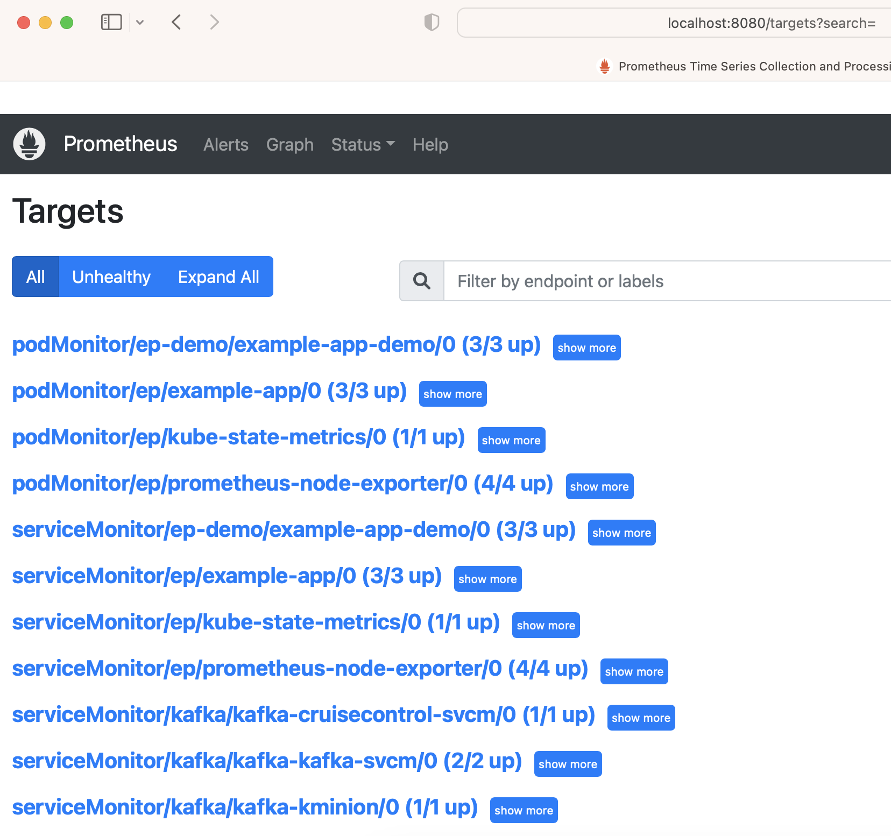

Test egress and ingress reachability between `test-ubuntu` pod on the istio mesh in `ns-demo` namespace and Prometheus running outside the istio mesh using `curl`.

https://istio.io/latest/docs/tasks/traffic-management/egress/egress-control/

> By default, Istio configures the Envoy proxy to pass through requests for unknown services.
>
> Run the following command to verify that `meshConfig.outboundTrafficPolicy.mode` option is set to `ALLOW_ANY` or is omitted:
>
> `$ kubectl get istiooperator installed-state -n istio-system -o jsonpath='{.spec.meshConfig.outboundTrafficPolicy.mode}'`
>
> `ALLOW_ANY`
>
> You should either see `ALLOW_ANY` or no output (default `ALLOW_ANY`).

```
test-ubuntu pod on the istio mesh in ns-demo namespace   <--->  Prometheus running outside the istio mesh

kubectl create -f test_ubuntu.yaml

# 2/2 below shows 2 containers running in the pod - test-ubuntu container and envoy istio-proxy
# sidecar container injected into ns-demo namespace by the istio mesh

$ kubectl get pods -n ns-demo | grep test-ubuntu
test-ubuntu-5fdc69977-dzrxj           2/2     Running   0             83s

# check envoy istio-proxy sidecar container in the pod injected into ns-demo namespace
# by the istio mesh

$ kubectl describe pod test-ubuntu-5fdc69977-dzrxj -n ns-demo | grep 'Image:.*istio-proxy'
    Image:         reg-name/istio-proxyv2:v1.15.3-bzc.0
    Image:         reg-name/istio-proxyv2:v1.15.3-bzc.0

$ kubectl get pod test-ubuntu-5fdc69977-dzrxj -n ns-demo -o=jsonpath='{.spec.initContainers[*].image}{"\n"}'
reg-name/istio-proxyv2:v1.15.3-bzc.0

$ kubectl get pod test-ubuntu-5fdc69977-dzrxj -n ns-demo -o=jsonpath='{.spec.containers[*].image}{"\n"}'
reg-name/istio-proxyv2:v1.15.3-bzc.0 ubuntu:xenial

$ kubectl logs test-ubuntu-5fdc69977-dzrxj -n ns-demo
sleeping forever ...

######## get into bash shell of test-ubuntu pod on the istio mesh

$ kubectl exec -it test-ubuntu-5fdc69977-dzrxj -n ns-demo -- /bin/bash
root@test-ubuntu-5fdc69977-dzrxj:/# 

apt-get update
apt-get upgrade
apt-get install dnsutils
apt-get install curl

######## check DNS of prometheus services inside test-ubuntu pod on the istio mesh

# nslookup prometheus.ep.svc.cluster.local
Server:		10.100.0.10
Address:	10.100.0.10#53
Name:	prometheus.ep.svc.cluster.local
Address: 10.100.9.150

# nslookup ep-kube-state-metrics.ep.svc.cluster.local
Server:		10.100.0.10
Address:	10.100.0.10#53
Name:	ep-kube-state-metrics.ep.svc.cluster.local
Address: 10.100.25.195

# nslookup ep-node-exporter-prometheus-node-exporter.ep.svc.cluster.local
Server:		10.100.0.10
Address:	10.100.0.10#53
Name:	ep-node-exporter-prometheus-node-exporter.ep.svc.cluster.local
Address: 10.100.14.186

######## check metrics exposed by prometheus using DNS inside test-ubuntu pod on the istio mesh

# curl -vvvv prometheus.ep.svc.cluster.local:9090/graph
< HTTP/1.1 200 OK
<title>Prometheus Time Series Collection and Processing Server</title>

# curl -vvvv prometheus.ep.svc.cluster.local:9090/targets
< HTTP/1.1 200 OK
<title>Prometheus Time Series Collection and Processing Server</title>

curl -vvvv ep-kube-state-metrics.ep.svc.cluster.local:8080/metrics
curl -vvvv ep-kube-state-metrics.ep.svc.cluster.local:8080/metrics | grep kube_

curl -vvvv ep-node-exporter-prometheus-node-exporter.ep.svc.cluster.local:9100/metrics
curl -vvvv ep-node-exporter-prometheus-node-exporter.ep.svc.cluster.local:9100/metrics | grep node_
```

#### Scrape service and pod in a different namespace

```
kubectl create -f diff-ns-test.yaml
```

Service and pod in a different namespace (`ep-demo`) scraped by prometheus in the prometheus GUI:


